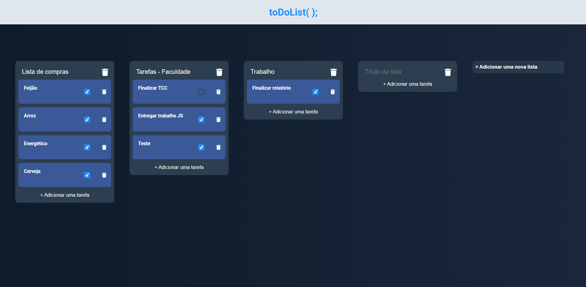

# toDoList( ); by Feex

## Descrição

Este é um simples aplicativo de **lista de tarefas** (to-do list), desenvolvido em HTML, CSS e JavaScript, que permite ao usuário criar listas, adicionar tarefas a essas listas, marcar as tarefas como concluídas e excluir tanto listas quanto tarefas. O aplicativo também utiliza o **localStorage** para salvar os dados localmente, permitindo que as informações persistam mesmo após o usuário atualizar a página.

## 📸 Preview

 >

## Funcionalidades

- **Criar listas**: O usuário pode adicionar múltiplas listas de tarefas.
- **Adicionar tarefas**: Cada lista pode ter várias tarefas, que podem ser marcadas como concluídas ou não.
- **Excluir listas e tarefas**: O usuário pode remover tanto listas quanto tarefas específicas.
- **Persistência de dados**: As listas e tarefas são salvas no `localStorage` para persistência entre atualizações da página.

## Tecnologias Utilizadas

- **HTML5**: Estrutura do site e criação dos elementos.
- **CSS3**: Estilo e layout do site.
- **JavaScript**: Lógica para a interação e manipulação do DOM, além da persistência de dados utilizando `localStorage`.
- **Font Awesome**: Ícones utilizados para botões (trash, etc.).

## Como Usar

1. Clone o repositório para sua máquina local:
   ```bash
   git clone https://github.com/feex11/toDoList.git
2. Navegue até o diretório do projeto:
  ```bash
  cd toDoList
  ```
3. Abra o arquivo index.html em um navegador de sua escolha.


